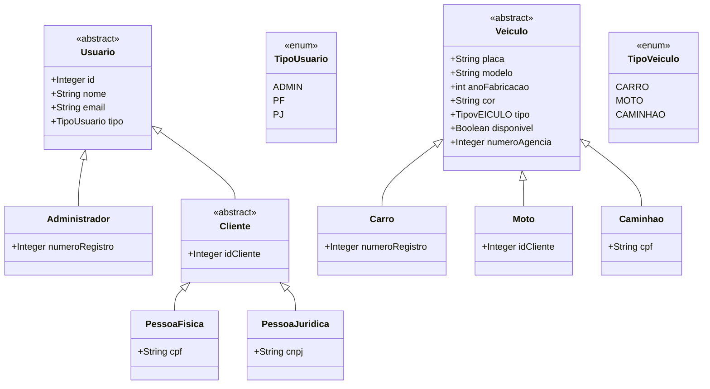
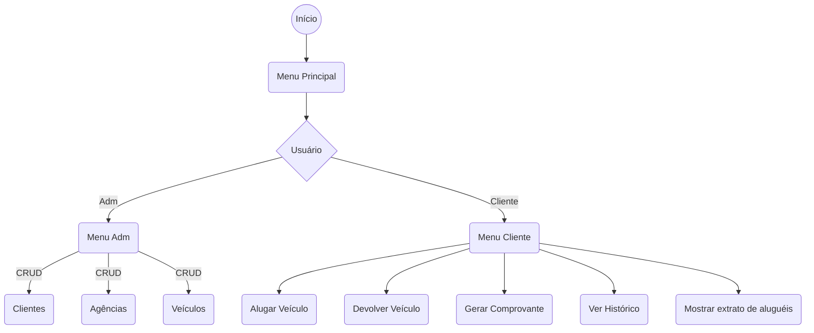

# Documentação do Projeto Rental Cars

## Introdução

Este é um projeto de locação de veículos desenvolvido como parte do programa Santander Coders.
O sistema simula uma locadora de veículos


## Tecnologias Utilizadas

- **Java**: Linguagem de programação utilizada para o desenvolvimento do sistema.
- **Estruturas de Dados**: Listas, Classes e Objetos.
- **Console Colors**: Para exibir mensagens coloridas no console.

## Estrutura do Projeto

A estrutura do projeto é organizada conforme o diagrama de classes a seguir:


## Fluxograma - Menus


## Como Utilizar

### Clonando o repositório

1. **Clone do repositório**:
    ```bash
   git clone https://github.com/danielrdrgsn/projeto-rental-cars
   ```
2. **Navegue até o diretório do projeto**
   ```bash 
    cd projeto-rental-cars/src

### Executando o programa

```bash
  Java Main.java
```


## Participantes

- [Daniel Rodrigues](https://github.com/danielrdrgsn)
- [Eloise Helena](https://github.com/EloiseHelena)
- [Thiago Vinícius](https://github.com/Thiagoqdev)
- [Samuel Quaresma](https://github.com/squoliver83)
- [Vinícius Augusto](https://github.com/vinicius-augusto1)