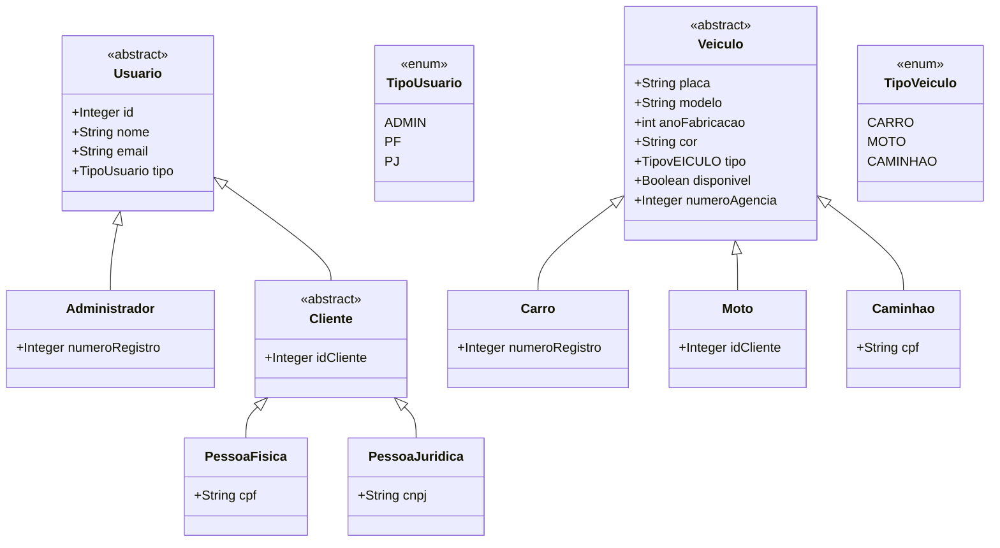
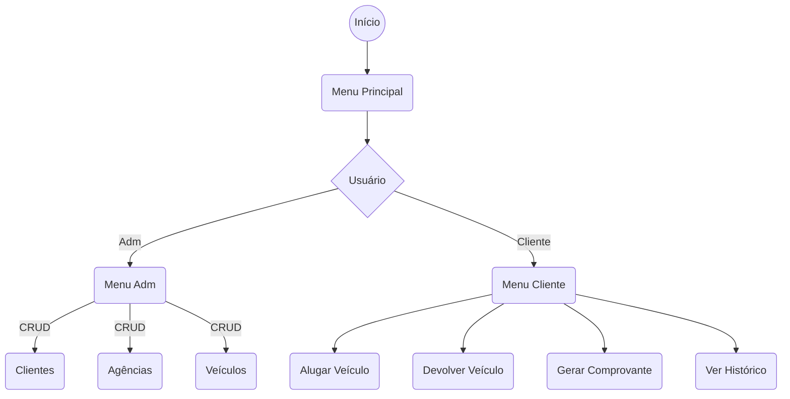

## Diagrama de classes - Entidades

```mermaid
classDiagram
    Usuario <|-- Administrador
    Usuario <|-- Cliente
    Cliente <|-- PessoaFisica
    Cliente <|-- PessoaJuridica
    
    class Usuario {
        <<abstract>>
        +Integer id
        +String nome
        +String email
        +TipoUsuario tipo
    }
    class Administrador{
      +Integer numeroRegistro
    }
    class Cliente{
        <<abstract>>
      +Integer idCliente
    }
    class PessoaFisica{
      +String cpf
    }
    class PessoaJuridica{
      +String cnpj
    }
    class TipoUsuario{
        <<enum>>
        ADMIN
        PF
        PJ
    }

    Veiculo <|-- Carro
    Veiculo <|-- Moto
    Veiculo <|-- Caminhao
    
    class Veiculo {
        <<abstract>>
        +String placa
        +String modelo
        +int anoFabricacao
        +String cor
        +TipovEICULO tipo
        +Boolean disponivel
        +Integer numeroAgencia
    }
    
    class Carro{
      +Integer numeroRegistro
    }
    class Moto{
      +Integer idCliente
    }
    class Caminhao{
      +String cpf
    }
    class TipoVeiculo{
        <<enum>>
        CARRO
        MOTO
        CAMINHAO
    }
```
## Fluxograma - Menus

```mermaid
flowchart TD
    A((Início)) --> B(Menu Principal)
    B --> C{Usuário}
    C -- Adm --> D(Menu Adm)
    C -- Cliente --> E(Menu Cliente)
    D -- CRUD --> F(Clientes)
    D -- CRUD --> G(Agências)
    D -- CRUD --> H(Veículos)
    E --> I(Alugar Veículo)
    E --> J(Devolver Veículo)
    E --> K(Gerar Comprovante)
    E --> L(Ver Histórico)
```
